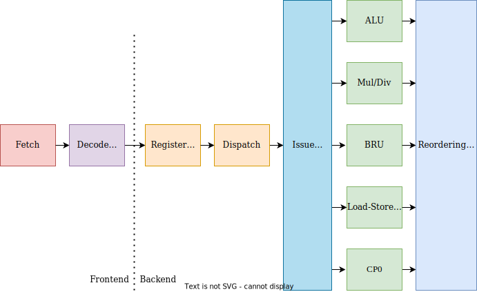

# Hop: HUST Out-of-order Processor

Please refer to [Core.scala](../src/main/scala/Core.scala) for the details of the connections between the modules.

## Instruction Fetch

- Fetch instructions from SRAM (or *InstCache*) to flow down the pipeline.
- Manage PC register by `PC <- PC+4` or using the redirect signals from *backend*.

## Instruction Decoder & Branch Prediction

- Decoding instructions: coding style is referred from [RocketChip](https://github.com/chipsalliance/rocket-chip/blob/master/src/main/scala/rocket/IDecode.scala) (highly recommended). The decoder is quite decoupled, and can be easily replaced for other ISAs (e.g., RISC-V, ARM, etc) if no big changes happen in the control signals.
- Branch prediction: currently only static branch prediction, but the interface for 2-bit dynamic branch prediction is reserved.

## Register Renaming Unit

*Renaming* is a technique to rename the ISA (or *logical*) register specifiers in an instruction by mapping them to a new space of *physical* registers. The goal of *register renaming* is to break the output- (WAW) and anti-dependencies (WAR) between instructions, leaving only the true dependencies (RAW).

We use (1) *Rename Map Table* to record the mapping relations between logical and physical registers, and (2) *Free List* to manage (allocate/release) the available resources of physical registers. In addition, in order to make the pipeline run efficiently, we resolve the mapping and renaming in parallel with only one cycle.

In particular, for the special `HI/LO` registers, a different renaming namespace is used which is separated from the namespace for general-purpose registers; for CP0 registers, no renaming operation is performed.

## Instruction Dispatch Unit

This unit dispatches the register-renamed instructions to different issue queues and the Reordering Buffer (ROB) as well. (Note: The "dispatch to ROB" is debatable here. We prefer to say Dispatch Unit registers slots in ROB for those instructions, and instructions enter ROB after executing stage)

## Instruction Issue Queues

The issue queue is the first dividing point between sequential and out-of-order execution -- the dispatched instructions enter the queue sequentially, and an arbiter chooses to issue an instruction (which has all of its operands ready) into the following Execute Units regardless of the instruction order.

We use several separate issue queues (or called issue windows somewhere), partitioned on instruction type (e.g., short integer, long integer, and memory).

Additionally, we borrow the *Instruction Dependency Matrix (IDM)* idea from this [academic report](https://www.cs.uaf.edu/2012/fall/cs441/students/jl_out_of_order.pdf). It is used to record the data dependencies among instructions which have entered the issue queue. For example, entry `(i, j)` means the *i-th* instruction (abbreviated as *inst*) depends on the execution results of *j-th* inst.

The issue unit resolves the instruction scheduling and issuing based on the IDM. Compared to the [*ScoreBoard Method*](https://en.wikipedia.org/wiki/Scoreboarding) or [*Tomasulo's Algorithm*](https://en.wikipedia.org/wiki/Tomasulo%27s_algorithm), this IDM approach is more efficient and concise according to that report.

In details, for a fixed-cycle inst (e.g., arithmetic/logic inst), we uses a counter to record its executed cycles and clear the dependencies before the instruction enters the ROB; in this way, those instructions depending upon them can enter the execution stage and have RAW dependencies resolved by the *bypass* logic (rather than accessing the register file). Besides, for a non-fixed-cycle inst (e.g., memory access), the dependency matrix is updated when the instruction is *committed* (or called retired somewhere) in ROB.

## Register File

We uses two sets of physical register files: one for general-purpose physical registers (size 64 with five sets of read/write ports: for two integer units, one branch unit, one load-store unit, and one CP0 unit), and the other for `HI/LO` register file (size 4). In this way, we can simplify the renaming and allocation of the special `HI/LO` registers for MIPS multiplication and division insts.

In case of *branch misprediction recovery* or *exception handling*, no additional operations are required on the register file; we only need to restore the prior register rename map table and the free lists.

Also, *bypassing* could occur at the end of the *Register Read stage*.

Additionally, we implemented *XOR-based Multi-Ported RAMs* based on [Multi-Ported Memories for FPGAs via XOR (FPGA'12)](https://doi.org/10.1145/2145694.2145730). More information can be found in [Building Multiport Memories with Block RAMs](https://tomverbeure.github.io/2019/08/03/Multiport-Memories.html).

## Execute Units

The instructions in the Issue Queue enter the execution stage, after their operands are ready and being selected by the arbiter to issue.

The Execution Unit contains many different types of functional units to handle different operations: one normal integer ALU, one long integer ALU, one multiplier (simply uses `*` in Chisel), one divider (simply uses `/` and modulo operation), and one branch unit. Note that the multiplier/divider are not fully pipelined so far.

## Load-Store Unit

The Load-Store Unit is responsible for deciding when to fire memory operations to the memory system. There are three main partitions: the Address Generation Unit (AGU), the Load Unit (LDU), and the Store Buffer Unit (SBU).

- AGU is used to generate the valid memory address and check the dependencies at the same time.
- LDU is mainly used to load data from memory for load insts.
- SBU is used to buffer the data of store insts and write it to the memory during the *instruction commit stage* (to ensure the correctness of memory data after a branch misprediction, interrupt, or exception).

### Load

When a load inst comes, the Load Unit compares its address with all of the store addresses in the *Store Buffer*. If there is a match and the corresponding store data is present, the store data is *forwarded* to the load inst to finish the load execution. Otherwise, the Load Unit fires a memory request to load the required data from the memory system.

Note that the address in the Store Buffer is unique - a new store inst would always overwrite the old buffer slot - so that the Load Unit doesn't need to check which one is the newest for data forwarding.

Under the above circumstance, one load inst executes *only after* the previous store insts to the same address complete. (If a load incorrectly executes ahead of an older store to the same address, it will read out stale data). However, the load insts between two store insts could be executed in an out-of-order way.

### Store

When a store inst comes, the Store Unit will buffer it since the instruction could be *speculatively* executed. Only after the branch prediction is verified to be correct, the slots/entries of Store Buffer can be fired to main memory.

The store insts are executed in program order, so we don't need to detect conflicts of memory addresses.

We mainly refer to [Shelley Chen, Jennifer Morris. Out-of-Order Memory Accesses Using a Load Wait Buffer](http://users.ece.cmu.edu/~schen1/18-741_final_report.pdf) for our implementation.

## Reordering Buffer

The ROB tracks the state of all inflight instructions in the pipeline. The role of the ROB is to provide the illusion to the programmer that their program executes in-order (we would say ROB is the second dividing point between out-of-order and in-order execution). If a branch misprediction, exception, or interrupt occurs, the ROB is tasked with helping reset the *micro-architectural state* (recover the prior state). Also, ROB makes the *precise interrupts* possible for the processor.

After instructions are decoded and renamed, they are then dispatched to the ROB (recording the order info) and the issue queue and marked *busy*. As instructions finish execution, they inform the ROB and are marked *not-busy*. Once the head of the ROB is no longer busy, the instruction is *committed*, and its *architectural state* is now visible.

In particular, for branch/jump insts at the head of the ROB, we borrow the design of the *Branch Mask* (where each bit - initiated in decoding stage - indicates that the instruction depends on a certain branch/jump inst) from [UCB-BOOM](https://docs.boom-core.org/en/latest/sections/execution-stages.html?highlight=mask#branch-unit-branch-speculation). If a branch misprediction occurs, the ROB will cancel the instructions according to the branch mask; Moreover, if an exception occurs and the excepting instruction is at the head of the ROB, the pipeline is flushed and the rename map tables are restored by ROB over many cycles. The ROB firstly redirects PC to fetch instructions of the appropriate exception handler and lastly redirects PC to the address in EPC when the exception handler returns.
